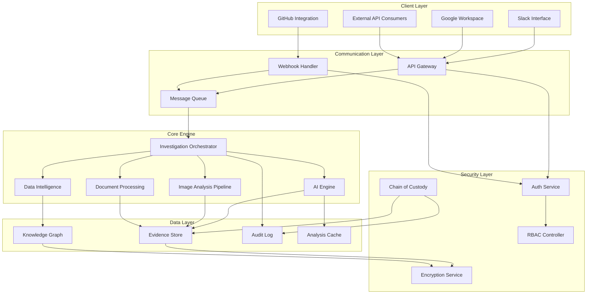
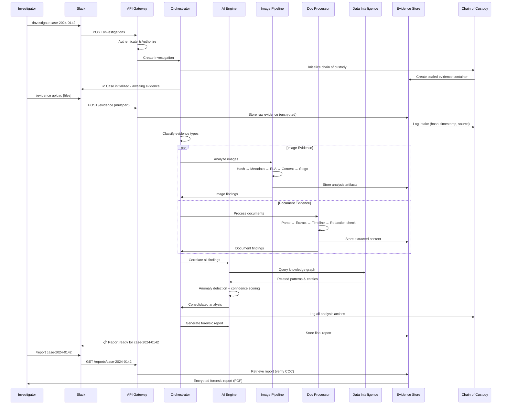

# ARCHITECTURE.md

# Forensic Analysis System Architecture

## 1. System Overview



---

## 2. Core Components

### 2.1 AI Engine

The central intelligence unit responsible for reasoning, classification, and correlation.

| Module | Responsibility |
|---|---|
| **LLM Orchestrator** | Manages prompts, context windows, and model selection |
| **Classification Engine** | Categorizes evidence by type, relevance, and severity |
| **Anomaly Detector** | Identifies patterns inconsistent with baseline behavior |
| **Correlation Engine** | Links disparate evidence across sources and timelines |
| **Report Generator** | Produces structured forensic reports with citations |

```
┌─────────────────────────────────────────────┐
│                  AI ENGINE                   │
│                                             │
│  ┌───────────┐  ┌──────────────────────┐   │
│  │   LLM     │  │  Classification      │   │
│  │Orchestrator│──│  Engine              │   │
│  └─────┬─────┘  └──────────┬───────────┘   │
│        │                   │                │
│  ┌─────▼─────┐  ┌─────────▼───────────┐   │
│  │  Anomaly  │  │   Correlation        │   │
│  │  Detector │──│   Engine             │   │
│  └─────┬─────┘  └──────────┬──────────┘   │
│        │                   │               │
│        └───────┬───────────┘               │
│          ┌─────▼─────┐                     │
│          │  Report   │                     │
│          │ Generator │                     │
│          └───────────┘                     │
└─────────────────────────────────────────────┘
```

### 2.2 Image Analysis Pipeline

Multi-stage pipeline for forensic image examination.

**Stages:**

1. **Ingestion** — Format validation, hash computation (SHA-256, MD5)
2. **Metadata Extraction** — EXIF, IPTC, XMP, filesystem metadata
3. **Integrity Verification** — Error Level Analysis (ELA), hash chain validation
4. **Content Analysis** — Object detection, OCR, facial recognition (optional)
5. **Steganography Detection** — LSB analysis, frequency domain inspection
6. **Tampering Detection** — Clone detection, splicing identification, JPEG ghost analysis

```
Input ──► Ingest ──► Metadata ──► Integrity ──► Content ──► Stego ──► Tamper ──► Report
           │           │            │              │          │          │
           ▼           ▼            ▼              ▼          ▼          ▼
        [Hash DB]  [Meta Store] [ELA Results] [ML Models] [Freq DB] [Evidence]
```

### 2.3 Document Processing

Handles structured and unstructured document forensics.

- **Format Parsers** — PDF, DOCX, XLSX, email (EML/MSG), plain text
- **Metadata Analyzer** — Author tracking, revision history, hidden data extraction
- **Content Extractor** — Text extraction, table parsing, embedded object recovery
- **Timeline Builder** — Constructs chronological event sequences from documents
- **Redaction Detector** — Identifies redacted or deleted content artifacts

### 2.4 Communication Layer

Manages all external and internal message routing.

```
External Request
       │
       ▼
┌──────────────┐     ┌───────────────┐
│  API Gateway │────►│  Rate Limiter  │
│  (REST/WSS)  │     └───────┬───────┘
└──────┬───────┘             │
       │              ┌──────▼───────┐
       │              │  Auth/RBAC   │
       │              └──────┬───────┘
       ▼                     │
┌──────────────┐      ┌─────▼────────┐
│   Webhook    │      │   Message    │
│   Handler    │─────►│   Queue      │
└──────────────┘      │  (Priority)  │
                      └──────┬───────┘
                             │
                    ┌────────▼────────┐
                    │  Investigation  │
                    │  Orchestrator   │
                    └─────────────────┘
```

### 2.5 Data Intelligence

Knowledge management and analytical reasoning layer.

| Capability | Description |
|---|---|
| **Knowledge Graph** | Entity-relationship mapping across investigations |
| **Timeline Synthesis** | Cross-source temporal reconstruction |
| **Pattern Library** | Known fraud/attack pattern matching |
| **Confidence Scoring** | Statistical confidence for each finding |
| **Link Analysis** | Multi-hop relationship discovery |

---

## 3. Integration Points

### 3.1 Google Workspace

```yaml
Services:
  Google Drive:
    - Evidence file retrieval and storage
    - Version history analysis
    - Sharing/permission audit trails
  Gmail:
    - Email header forensics
    - Attachment extraction and analysis
    - Communication pattern mapping
  Google Docs/Sheets:
    - Revision history reconstruction
    - Collaborator activity timelines
    - Comment and suggestion forensics
Authentication: OAuth 2.0 (Service Account + Domain-Wide Delegation)
Scopes: drive.readonly, gmail.readonly, documents.readonly
```

### 3.2 GitHub

```yaml
Integration Method: GitHub App + Webhooks
Capabilities:
  - Commit history forensics and author verification
  - Code change analysis for IP theft investigation
  - Access log correlation
  - Repository permission auditing
  - Secret detection in commit history
Events Monitored:
  - push, pull_request, member, repository
  - organization, team, deployment
```

### 3.3 Slack

```yaml
Integration Method: Slack Bot (Socket Mode + Events API)
Capabilities:
  - Investigation initiation via slash commands
  - Real-time alert delivery to investigation channels
  - Interactive evidence review workflows
  - Status reporting and case updates
Commands:
  /investigate <case-id>    - Launch new investigation
  /evidence <upload>        - Submit evidence
  /status <case-id>        - Query case status
  /report <case-id>        - Generate forensic report
```

### 3.4 External APIs

| API | Purpose | Auth Method |
|---|---|---|
| VirusTotal | Malware/hash reputation lookup | API Key |
| Shodan | Infrastructure reconnaissance | API Key |
| Have I Been Pwned | Credential exposure checks | API Key |
| OpenAI / Anthropic | LLM inference | API Key + OAuth |
| Cloud Storage (S3/GCS) | Long-term evidence archival | IAM / Service Account |
| WHOIS/DNS | Domain intelligence | API Key |

---

## 4. Data Flow — Typical Forensic Investigation



### Data Flow Summary

```
Evidence Intake → Hashing & Sealing → Classification → Parallel Analysis
       → Correlation → AI Reasoning → Confidence Scoring → Report Generation
```

**Key Principle:** Every state transition is logged to the Chain of Custody with cryptographic proof.

---

## 5. Security Considerations

### 5.1 Data Protection

- **Encryption at Rest:** AES-256-GCM for all evidence and analysis artifacts
- **Encryption in Transit:** TLS 1.3 for all communications; mTLS between internal services
- **Key Management:** HSM-backed key storage; per-investigation encryption keys
- **Data Isolation:** Tenant-level and case-level logical separation

### 5.2 Chain of Custody

```
┌──────────────────────────────────────────────────┐
│              CHAIN OF CUSTODY LOG                 │
│                                                  │
│  Entry Format:                                   │
│  ┌────────────────────────────────────────────┐  │
│  │ Timestamp  : ISO-8601 (UTC)                │  │
│  │ Actor      : authenticated user/service ID │  │
│  │ Action     : intake|access|analyze|export  │  │
│  │ Evidence   : SHA-256 hash reference        │  │
│  │ Prev Hash  : hash of previous log entry    │  │
│  │ Signature  : Ed25519 digital signature     │  │
│  └────────────────────────────────────────────┘  │
│                                                  │
│  Properties:                                     │
│  • Append-only immutable log                     │
│  • Cryptographically chained entries             │
│  • Independently verifiable by third parties     │
│  • Tamper-evident by design                      │
└──────────────────────────────────────────────────┘
```

### 5.3 Access Control

| Layer | Mechanism |
|---|---|
| **Authentication** | OAuth 2.0 / OIDC with MFA enforcement |
| **Authorization** | Role-Based Access Control (RBAC) with case-level scoping |
| **API Security** | Rate limiting, request signing, IP allowlisting |
| **Audit** | Complete access logging with tamper-proof storage |

**Roles:**

- `admin` — System configuration, user management
- `lead_investigator` — Full case access, report approval
- `investigator` — Evidence submission, analysis review
- `reviewer` — Read-only report access
- `service` — Machine-to-machine integration scope

### 5.4 Compliance & Legal

- Evidence handling follows **NIST SP 800-86** digital forensics guidelines
- Audit trails satisfy **Federal Rules of Evidence** (FRE 901/902) requirements
- PII handling compliant with **GDPR** and **CCPA** where applicable
- All AI-generated conclusions include confidence scores and source citations
- Human-in-the-loop required for final report approval

### 5.5 Threat Mitigations

| Threat | Mitigation |
|---|---|
| Evidence tampering | Cryptographic hashing at intake + immutable COC |
| Unauthorized access | MFA + RBAC + case-scoped permissions |
| Data exfiltration | DLP policies, encrypted exports, audit logging |
| AI hallucination | Confidence scoring, source citation, human review |
| Supply chain attack | Dependency pinning, SBOM generation, signed builds |
| Insider threat | Segregation of duties, dual-approval for exports |

---

*Last updated: 2025 | Version: 2.1.0*